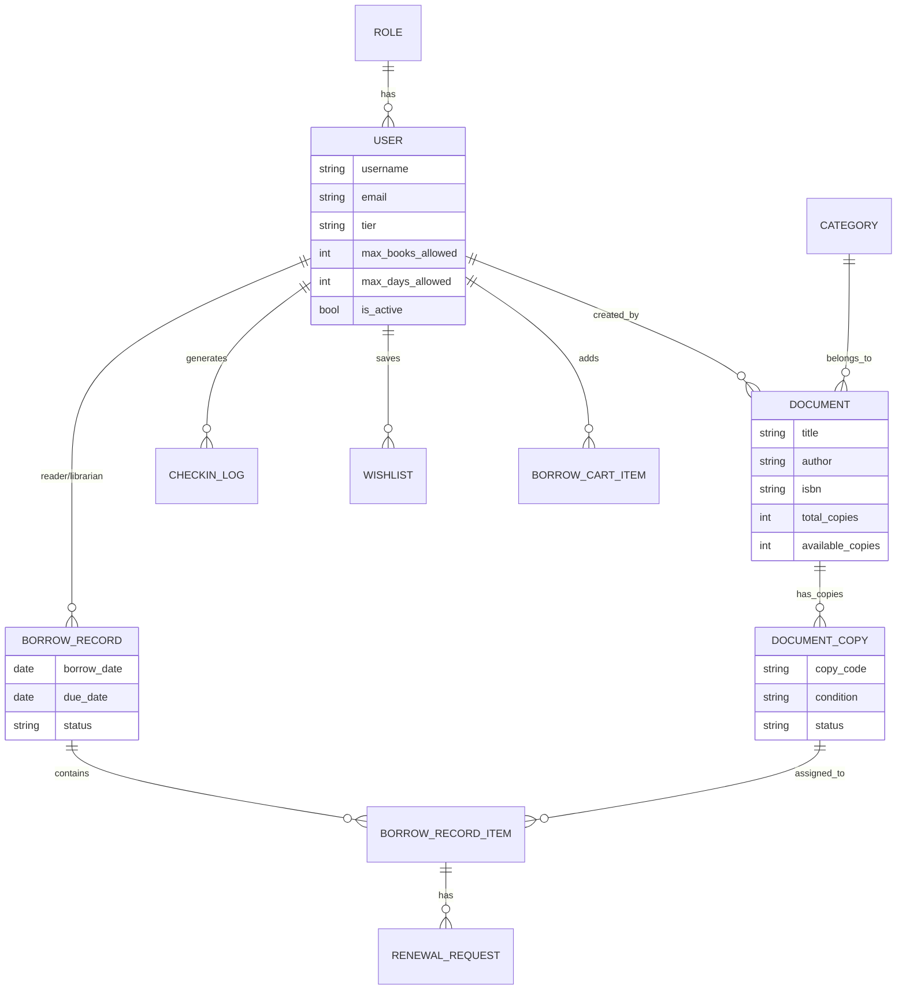

# Hệ thống Quản lý Thư viện Thông minh (Smart Library Management System)

## 📌 Giới thiệu
Dự án là một nền tảng quản lý thư viện toàn diện, tập trung vào việc số hóa quy trình vận hành và tối ưu hóa trải nghiệm mượn/trả tài liệu. Hệ thống tích hợp kiểm soát an ninh ra vào tự động và quản lý vòng đời tài liệu chặt chẽ giữa độc giả và thư viện.

## 🚀 Công nghệ sử dụng
Hệ thống được xây dựng trên kiến trúc hiện đại, đảm bảo tính hiệu năng và khả năng mở rộng:

### Backend
- **Ngôn ngữ**: Python 3.10+
- **Framework**: FastAPI (High performance Python API framework)
- **Database**: MongoDB (NoSQL database for flexibility)
- **ODM**: Odmantic (Pydantic-based ODM for MongoDB)
- **Authentication**: JWT (JSON Web Tokens)

### Frontend
- **Framework**: React / UmiJS
- **UI Component**: Ant Design (Premium UI Kit)
- **State Management**: Model-based architecture (Umi/Dva)

---

## 🛠️ Tính năng cốt lõi

### 1. Dành cho Độc giả (Reader)
- **Tra cứu tài liệu**: Tìm kiếm, lọc và xem thông tin chi tiết sách.
- **Danh sách quan tâm (Wishlist)**: Lưu lại các tài liệu muốn mượn trong tương lai.
- **Giỏ mượn sách (Borrow Cart)**: Đăng ký mượn sách trực tuyến trước khi đến quầy.
- **Quản lý mượn trả**: Theo dõi trạng thái sách đang mượn, lịch sử mượn trả.
- **Gia hạn trực tuyến**: Gửi yêu cầu gia hạn thời gian mượn (đang chờ duyệt).
- **Check-in/Check-out**: Tự động ghi lại nhật ký ra vào thư viện.

### 2. Dành cho Thủ thư (Librarian)
- **Xử lý mượn trả**: Nhập mã để xác nhận giao dịch mượn/trả sách.
- **Kiểm soát ra vào**: Theo dõi màn hình check-in trực tiếp, xử lý các trường hợp ngoại lệ.
- **Phê duyệt gia hạn**: Xem xét và duyệt/từ chối các yêu cầu gia hạn từ độc giả.
- **Quản lý kho tài liệu**: Thêm mới sách, quản lý các bản sao (Document Copy), cập nhật tình trạng sách.
- **Phân loại**: Quản lý danh mục, thể loại và vị trí kệ sách.

### 3. Dành cho Quản trị viên (Admin)
- **Quản lý người dùng**: Phân quyền (Admin/Librarian/Member), khóa/mở khóa tài khoản.
- **Thiết lập hệ thống**: Cấu hình quy định thư viện (Số lượng sách mượn tối đa, số ngày mượn).
- **Dashboard & Báo cáo**: 
  - Thống kê lưu lượng người ra vào theo thời gian thực.
  - Top sách được mượn nhiều nhất.
  - Tỷ lệ trả muộn và báo cáo vi phạm.
  - Xuất dữ liệu báo cáo ra Excel.

---

## 📊 Kiến trúc Cơ sở Dữ liệu (MongoDB Schema)

Dưới đây là sơ đồ mối quan hệ giữa các Collection chính trong hệ thống:



---

## 🛠️ Hướng dẫn cài đặt

### Backend
1. Yêu cầu: Python 3.10+, MongoDB.
2. Cài đặt thư viện:
   ```bash
   cd backend
   pip install -r requirements.txt
   ```
3. Cấu hình môi trường: Tạo file `.env` từ `.env.example`.
4. Khởi tạo database:
   ```bash
   python init_db.py
   ```
5. Khởi chạy server:
   ```bash
   uvicorn app.main:app --reload
   ```

### Frontend
1. Cài đặt dependencies:
   ```bash
   cd base-web-umi
   npm install
   ```
2. Khởi chạy môi trường phát triển:
   ```bash
   npm run dev
   ```


---

### Tài khoản test:

User: test123/123456
Admin: admin / admin123
Library: library / library123